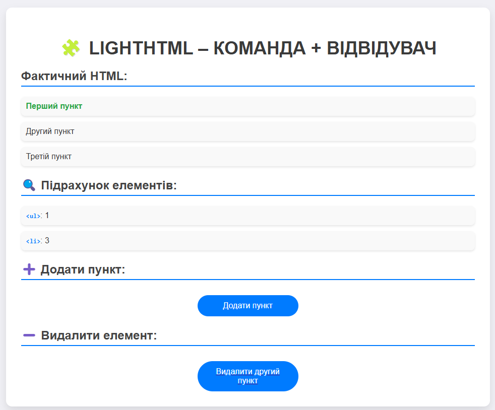

# LightHTML Patterns

Цей проект демонструє використання різних шаблонів проектування в PHP для маніпуляції з DOM-структурами за допомогою класу LightHTML. Приклади реалізації таких шаблонів:

- **Команда** 
- **Відвідувач** 
- **Ітератор** 
- **Стейт** 
- **Шаблонний метод** 

## Опис шаблону

### 1. Команда 
Шаблон Команда дозволяє інкапсулювати запит як об'єкт, що дозволяє параметризувати клієнтів за допомогою різних запитів, ставити запити в чергу та підтримувати незворотність операцій. У цьому проекті ми використовуємо команди для додавання, видалення класів та встановлення атрибутів для елементів.

#### Скриншот:

### 2. Відвідувач 
Шаблон Відвідувач дозволяє додавати нову поведінку елементам без зміни їх класів. У цьому проекті ми використовуємо патерн Відвідувач для підрахунку кількості елементів різних тегів у DOM-структурі, де кожен тип елемента обробляється окремо від інших.

#### Скриншот:

### 3. Ітератор 
Шаблон Ітератор дозволяє перебирати елементи колекції без доступу до їх внутрішньої структури. У цьому прикладі використовується клас `DepthIterator` для глибокої ітерації по деревоподібній структурі. Ітератор дозволяє по черзі обходити всі елементи в колекції без необхідності розкривати внутрішні деталі реалізації.

#### Скриншот:

## Автор

- Козік Анастасія ВТк-24-1