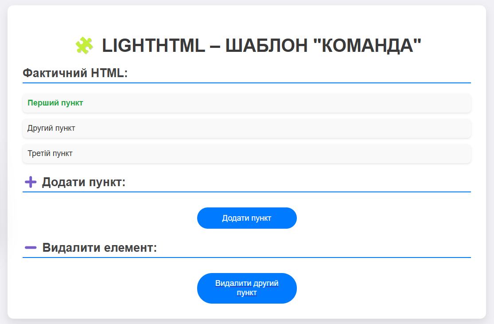

## Опис шаблону

### 1. Команда 
Шаблон Команда дозволяє інкапсулювати запит як об'єкт, що дозволяє параметризувати клієнтів за допомогою різних запитів, ставити запити в чергу та підтримувати незворотність операцій. У цьому проекті ми використовуємо команди для додавання, видалення класів та встановлення атрибутів для елементів.

#### Скриншоти:

## Автор

- Козік Анастасія ВТк-24-1