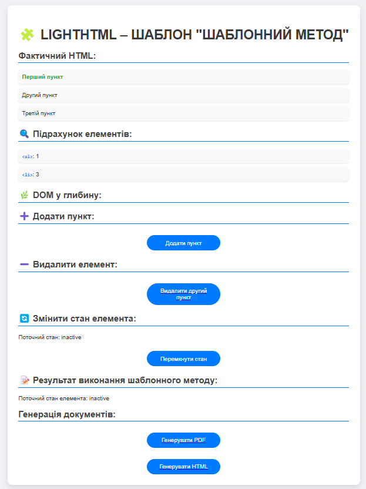

## Опис шаблону

### 5. Шаблонний метод 
Шаблонний метод визначає алгоритм у базовому класі, дозволяючи підкласам змінювати певні кроки алгоритму без зміни його загальної структури. В даному випадку шаблонний метод використовується для виконання операцій над елементами DOM, з можливістю для підкласів визначити власні кроки виконання. Крім того, за допомогою шаблонного методу можна зберігати результати роботи алгоритму у вигляді файлів (HTML або PDF) у зазначену директорію, дозволяючи зберігати документи без додаткових бібліотек.

#### Скриншот:

## Автор

- Козік Анастасія ВТк-24-1

