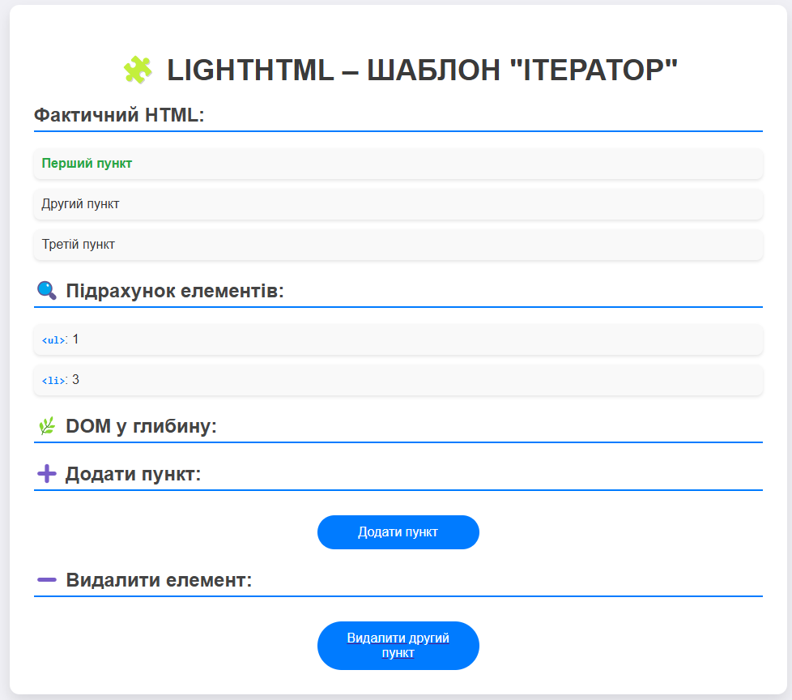
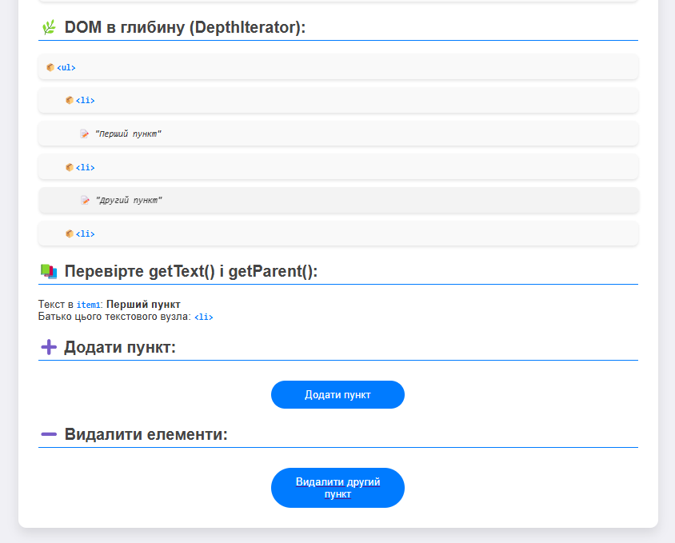

## Опис шаблону

### 3. Ітератор 
Шаблон Ітератор дозволяє перебирати елементи колекції без доступу до їх внутрішньої структури. У цьому прикладі використовується клас `DepthIterator` для глибокої ітерації по деревоподібній структурі. Ітератор дозволяє по черзі обходити всі елементи в колекції без необхідності розкривати внутрішні деталі реалізації.

#### Скриншоти:

## Автор

- Козік Анастасія ВТк-24-1