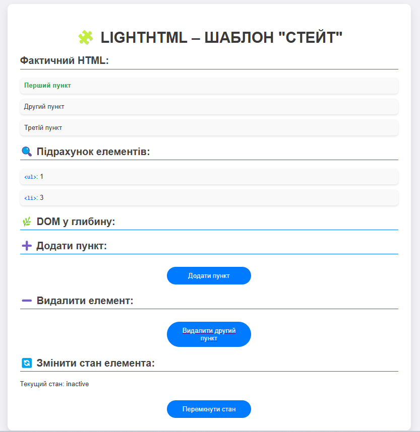

## Опис шаблону

### 4. Стейт 
Шаблон Стейт дозволяє об'єкту змінювати свою поведінку в залежності від внутрішнього стану. У цьому прикладі використовується клас `ElementState` для зміни стану елементів. Кожен елемент може перебувати в одному з кількох станів, і поведінка елемента змінюється в залежності від того, в якому стані він знаходиться.

#### Скриншот:

## Автор

- Козік Анастасія ВТк-24-1
