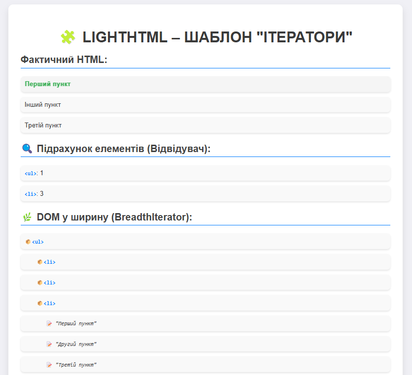

# LightHTML Patterns

Цей проект демонструє використання різних шаблонів проектування в PHP для маніпуляції з DOM-структурами за допомогою класу LightHTML. Приклади реалізації таких шаблонів:

- **Команда** 
- **Відвідувач** 
- **Ітератор** 
- **Стейт** 
- **Шаблонний метод** 

## Опис шаблону

### 1. Команда 
Шаблон Команда дозволяє інкапсулювати запит як об'єкт, що дозволяє параметризувати клієнтів за допомогою різних запитів, ставити запити в чергу та підтримувати незворотність операцій. У цьому проекті ми використовуємо команди для додавання, видалення класів та встановлення атрибутів для елементів.

#### Скриншот:

### 2. Відвідувач 
Шаблон Відвідувач дозволяє додавати нову поведінку елементам без зміни їх класів. У цьому проекті ми використовуємо патерн Відвідувач для підрахунку кількості елементів різних тегів у DOM-структурі, де кожен тип елемента обробляється окремо від інших.

#### Скриншот:

### 3. Ітератор 
Шаблон Ітератор дозволяє перебирати елементи колекції без доступу до їх внутрішньої структури. У цьому прикладі використовується клас `DepthIterator` для глибокої ітерації по деревоподібній структурі. Ітератор дозволяє по черзі обходити всі елементи в колекції без необхідності розкривати внутрішні деталі реалізації.

#### Скриншот:

### 4. Стейт 
Шаблон Стейт дозволяє об'єкту змінювати свою поведінку в залежності від внутрішнього стану. У цьому прикладі використовується клас `ElementState` для зміни стану елементів. Кожен елемент може перебувати в одному з кількох станів, і поведінка елемента змінюється в залежності від того, в якому стані він знаходиться.

#### Скриншот:

# 5. Шаблонний метод 
Шаблонний метод визначає алгоритм у базовому класі, дозволяючи підкласам змінювати певні кроки алгоритму без зміни його загальної структури. В даному випадку шаблонний метод використовується для виконання операцій над елементами DOM, з можливістю для підкласів визначити власні кроки виконання. Крім того, за допомогою шаблонного методу можна зберігати результати роботи алгоритму у вигляді файлів (HTML або PDF) у зазначену директорію, дозволяючи зберігати документи без додаткових бібліотек.

#### Скриншот:

## Автор

- Козік Анастасія ВТк-24-1

